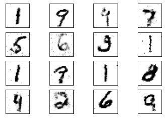
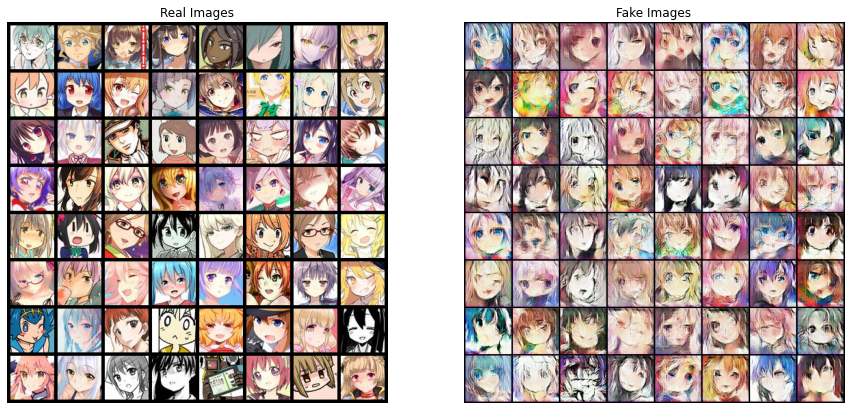
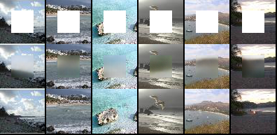

# CSCI365-Generative Adversarial Networks

#### Introduction

This project focuses on the exploration of generative adversarial network (GAN). A [generative adversarial network (GAN)](https://en.wikipedia.org/wiki/Generative_adversarial_network) is a class of machine learning frameworks designed by Ian Goodfellow and his colleagues in 2014. Two neural networks contest with each other in a game in the form of a zero-sum game, where one agent's gain is another agent's loss. In this project, we explore the basic concepts and structures behind the generative adversarial networks. We also perform this neural network on different datasets to learn some interesting application of this model. All the code we provided is written in python3 in jupyter notebook. 

#### Requirement

In this project, we are using the following packages:
1. Neural Network
    * [PyTorch](https://pytorch.org/)
2. Data Handler & Calculation
    * [NumPy](https://numpy.org/)
    * [pandas](https://pandas.pydata.org/)
    * [scikit-learn](https://scikit-learn.org/stable/)
    * [torchvision](https://pytorch.org/vision/stable/index.html)
3. Visualization
    * [Matplotlib](https://matplotlib.org/)
    * [Plotly](https://plotly.com/)
    * [Pillow](https://python-pillow.org/)
    * [tqdm](https://github.com/tqdm/tqdm)
Using the following command to install the package through pip
```bash
pip install pytorch numpy pandas sklearn torchvision matplotlib plotly PIL tqdm
```

#### Packges

1. [SimpleGANs](SimpleGANs.ipynb) provides the introduction to GANs. In this file, we use linear neural network and train GANs to learn about sine function. At the end of the training, this network is able to transfer a random series of numbers into sine-like clusters.

2. [MNIST](MNIST/) is a large dataset of handwritten digits that is commonly used for training various image processing systems. Here, we train GANs to generate hand written number through feeding with this dataset. We use two simple linear neural networks to implement this system. The following picture shows the random generated digits, where the input is a random series of number.



3. [AnimeCharacter](AnimeCharacterGeneration/) contains another application of GANs, where we use GANs to generated cartoon characters. The neural networks are consists of multiple layers of [convolutional layers](https://en.wikipedia.org/wiki/Convolutional_neural_network), feeding with [anime faces dataset](https://github.com/jayleicn/animeGAN). Input data for generator in this case is a 3-channel array consists of random number. The following picture demonstrates the real character we use to train discriminator and the fake character generated by the generator.



4. [Inpainting](Inpainting) refers to a conservation process where damaged, deteriorating, or missing parts of an artwork are filled in to present a complete image. Here, we specifically focus on filling the missing parts of the image. We use a subset of [ImageNet](http://www.image-net.org/) dataset to train our network. Every image inputed would be keep two version: the original version and a masked version. Masked images is created by adding a white mask to the center of the image. The task of generator is to fill these white areas to inpaint the image. The following image is a example of inpainting output. From top to bottom is masked image, inpainted image, original image



#### Reference
1. [Generative Adversarial Networks: Build Your First Models](https://realpython.com/generative-adversarial-networks/#your-first-gan)
2. [Animation dataset](https://drive.google.com/file/d/0B4wZXrs0DHMHMEl1ODVpMjRTWEk/view)
3. [animeGAN](https://github.com/jayleicn/animeGAN)
4. [DCGAN](https://pytorch.org/tutorials/beginner/dcgan_faces_tutorial.html)
5. [Context-Encoder GAN for Image Inpainting](https://www.kaggle.com/balraj98/context-encoder-gan-for-image-inpainting-pytorch/output)
6. [Tiny ImageNet Kaggle](https://www.kaggle.com/akash2sharma/tiny-imagenet)
7. [GANs-Application](https://github.com/nashory/gans-awesome-applications)
